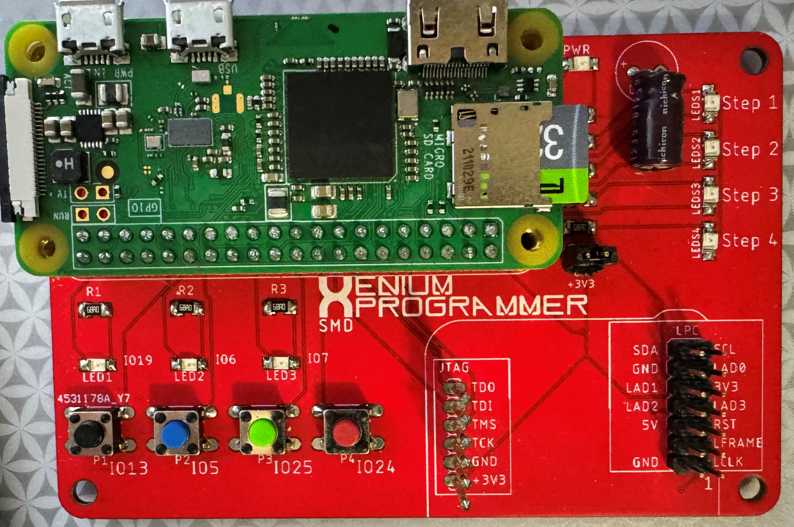
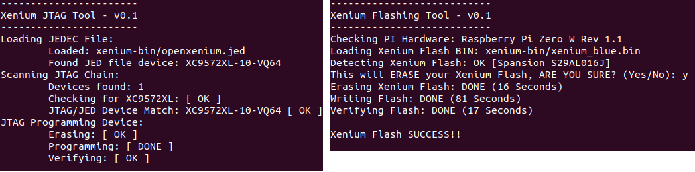
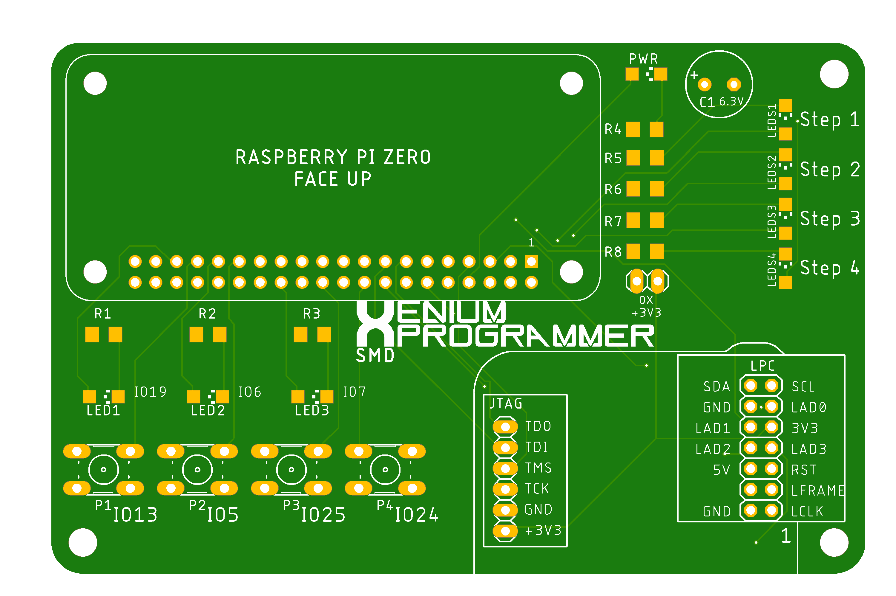

# OpenXenium JTAG and Flash Memory Chip programmer

**This is based on work done by [kooscode](https://github.com/kooscode/xenium-programmer) and [Ryzee119](https://github.com/ryzee119/openxenium) with modifications to program the bare ICs.  Most of the code here was done by kooscode (please visit the link above).

--------------

## * Read: ["Home Brew" on ORIGINAL XBOX](XBOX.md) - a detailed article on why and how *

The tools in this repo will allow you to use a Raspberry PI to program the CPLD and Flash Memory chips of the OpenXenium via Jtag and a custom 4-bit bus NOR Flash programming protocol.
Original project mentioned above allowed the use of an Onion Omega2+... This has been removed for this project. 

### Raspberry PI:
- This has only been tested on PI Zero W and PI 3B+ models so far.

https://www.pishop.us/product/raspberry-pi-zero-w/

-------------
## INSTALLING THE XENIUM PROGRAMMER
**The scripts assumes user of "pi"...  if using a different user, you'll need to manually change "pi" to your username in the scripts**
- After the OS has been written to your SD card, insert SD card into PC.
    - Add the following to the last line in "config.txt":   `enable_uart=1`
        - This is required to allow the PWR LED to function properly.
- Save edit and eject SD Card.  Insert SD card into Pi and boot up.
- Connect to the PI via SSH or Serial terminal
- If git is not installed, you need to install it:
    - `sudo apt-get install git`
- Clone this repo by running: `git clone https://github.com/dtomcat/AdvancedXeniumProgrammer.git`
- Change to program directory: `cd AdvancedXeniumProgrammer`
- Fix permission on install file:  `chmod 755 install`
- Then run: `./install`
- Setup service to listen for button presses:
    - `sudo cp xenium.service /etc/systemd/system/xenium.service`
    - `sudo systemctl daemon-reload`
    - `sudo systemctl enable xenium`
    - `sudo service xenium start`

## UPDATING XENIUM PROGRAMMER

- Connect to the PI via SSH or Serial terminal 
- Pull the latest code with: `git pull`
- Then run: `./install` 

-------------
## PROGRAMMING THE XENIUM CPLD AND/OR FLASH MEMORY (STANDALONE)

Note: You will need to provide your own PrometheOS bin file. (save it in the /xenium-bin folder as promOS.bin)

- After the PI has fully booted and the green led is on...
    - Press the FIRST button to program the OpenXenium with XeniumOS.
    - Hold the FIRST button to program the OpenXenium with PrometheOS.
    - Press the SECOND button to program the flash chip with XeniumOS. (**The CPLD must be programmed with the Bit Bang firmware or this will fail.)
    - Hold the SECOND button to program the flash chip with PrometheOS. (**The CPLD must be programmed with the Bit Bang firmware or this will fail.)
    - Press the THIRD button to program the CPLD with the OpenXenium Firmware.
    - Hold the THIRD button to program the CPLD with the BitBang Firmware.
    - Press the FOURTH button to clear any errors.
    - Hold the FOURTH button to shutdown the Raspberry Pi.

-------------
## PROGRAMMING THE XENIUM CPLD AND/OR FLASH MEMORY (SSH/SERIAL)
This is good to do if you keep getting an error trying to program the chips. (Red LED remains on)

Note: You will need to provide your own PrometheOS bin file. (save it in the /xenium-bin folder as promOS.bin)

- Connect to the PI via SSH or Serial terminal
- Change dir to AdvancedXeniumProgrammer
- You can program CPLD and FLASH in one single step with XeniumOS (XOS).
    - Run: `./xenium-programmer-smd`
- You can program CPLD and FLASH in one single step with PrometheOS (PromOS).
    - Run: `./PromOS-programmer-smd`
- You can program just the CPLD in one two ways.
    - To program the Bit Bang firmware: 
        - Run: `./BitBangOnly`
    - To program the OpenXenium firmware: 
        - Run: `./OX-Only_SMD`
- You can program just the Flash in oe of two ways. (The CPLD MUST have the Bit Bang Firmware loaded)
    - To program XOS:
          - Run: `./FlashOnly`
    - To program PromOS:
          - Run: `./FlashOnlyProm`

-------------

### PC BOARD

Huge thanks to James Bolding for the Original Eagle PCB hardware design!
This PCB design is based on his original work.  

- You can use the FREE Eagle PCB to load this up or just use the gerber files to have the PCB made at OSH Park!

--------------

### PARTS NOT LISTED IN BOM
There are a couple parts not listed in BOM that could be helpful.
- Pin headers 2.54 spacing
    - 1 2x7 for LPC port
    - 1 1x2 for 3v3 (Optionally... but connect two points with solder)
        - Will need a 2-Pin Jumper/Bridge Cap if installing 1x2 pin header
- 6 Pogo pins (P75-E3 pogo pins seem to work the best)

-------------
## CREDITS

- Koos du Preez - Creator (kdupreez@hotmail.com - Comments, improvements, critique, etc. is welcome!)
- Dtomcat - SMD programmer PCB design and code split to allow status LEDs.
- James Bolding - Orignal hardware design and PCB!
- Ryzee119 -  OpenXenium Firmware and hardware and all round awesomeness!
- XC3SPROG - Not sure who to thank here, but the source code was pivotal in making this work!
