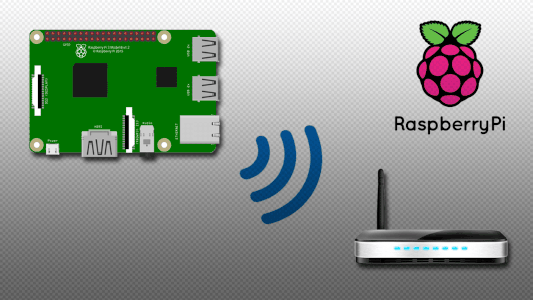
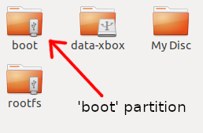

# Raspberry PI Scripts and Remote Access

If you dont have access to or dont want to use a keyboard, mouse and screen with your PI, you can use these scripts to get your PI to automatically boot with WIFI or USB Netowrk support and enable SSH, then you can access everything remotely via SSH. 

There are of course many ways to access your PI, this is a headless and remote way of doing it via wireless/USB Network and info provided here are purely for convenience.

- All files mentioned below must be copied to and edited in the `boot` partition on the SD card.
- Insert the PI's SD card into your computer and EDIT/COPY these files in the 'boot' partition.

# OPTION A - Setup WIFI (Wireless Access)

You can setup the PI to join your wirelesss network and then access it via wireless.

- Copy the `wpa_supplicant.conf` to the boto partition
- Edit this file and fill in your WIFI SSID and Password to automatically connect to WIFI on boot.
- NOTE: This file will be automatically applied and removed by the PI system after startup. 
- IF this does not work, try the Wired Access below..

# OPTION B - Setup USB Network Adapter (Wired Access)

If you dont have WIFI access to the PI or struggle to get it working, you can also enable the PI to become a USB Network adapter and then access it directly that way.

- Edit the `config.txt` file and place this line at the bottom of the file:  `dtoverlay=dwc2`
- Edit the `cmdline.txt` file and place this text at the end of the first line: `modules-load=dwc2,g_ether`
- Plug the USB into you computer and you will now have a USB Network adapter show up

# Connecting via SSH (Wireless OR Wired)

## Enable SSH
- Copy the `ssh` file to the boot partition as well to enable SSH
- This will enable SSH access to the PI
- NOTE: This file will be automatically applied and removed by the PI system after startup. 

## Connecting via SSH

- For a default or new PI setup, use any SSH tool and connect to `raspberrypi.local` with user `pi` and password `raspberry`
- If the MDNS name doesnt resolve, you might need to find your IP Address instead. Use Google for more details on that :)
- NOTE: It might take 5min for the initial load, wifi setup and mdns registration.. be patient.. 

### You should now be able to access your PI remotely via SSH and run the Xenium Flash tools
